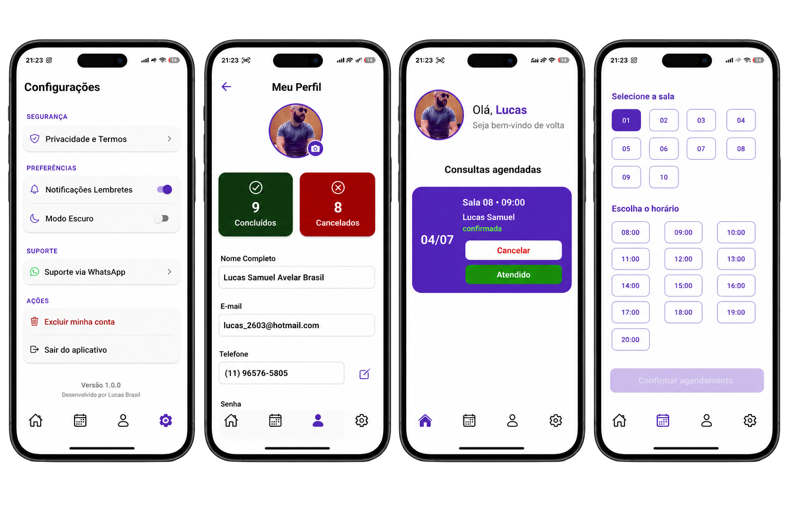

# Clínica Escola de Psicologia

Aplicativo desenvolvido em **React Native**, **Expo** e **Firebase**, criado como projeto de conclusão de semestre do curso de **Análise e Desenvolvimento de Sistemas**.

O objetivo do aplicativo é auxiliar a Clínica Escola de Psicologia no gerenciamento dos atendimentos realizados pelos estagiários, oferecendo uma experiência moderna, intuitiva e acessível.

---

  

----

# Sobre o projeto

Este projeto foi desenvolvido durante um trabalho interdisciplinar da faculdade.

Ao final do semestre, a coordenação do curso de Psicologia avaliaria os aplicativos desenvolvidos pelas equipes para selecionar um deles para implantação na Clínica Escola.

A clínica realiza atendimentos gratuitos para crianças, adolescentes e adultos em situação de vulnerabilidade social, sendo os atendimentos conduzidos por alunos do **7º semestre de Psicologia**, supervisionados pelos professores da instituição.

Durante o desenvolvimento, um dos principais objetivos foi construir uma aplicação que pudesse ser utilizada em um ambiente real, priorizando organização, facilidade de uso e acessibilidade.

---

# Destaques do projeto

- Aplicativo desenvolvido para um cenário real de utilização.
- Arquitetura baseada em React Native com Expo Router.
- Integração completa com Firebase Authentication e Cloud Firestore.
- Interface desenvolvida com foco em acessibilidade.
- Compatível com Android.
- Preparado para usuários de leitores de tela.

---

# Acessibilidade

Este projeto foi desenvolvido seguindo boas práticas de acessibilidade digital inspiradas nas recomendações da **WCAG (Web Content Accessibility Guidelines)**.

Durante o desenvolvimento foram realizados testes utilizando:

- TalkBack (Android)
- VoiceOver (iOS)

Recursos implementados:

- ✅ Compatibilidade com TalkBack
- ✅ Compatibilidade com VoiceOver
- ✅ Botões acessíveis
- ✅ Campos de formulário acessíveis
- ✅ Hierarquia de títulos
- ✅ Navegação acessível
- ✅ Feedback de sucesso e erro anunciado para leitores de tela
- ✅ Estados de componentes anunciados
- ✅ Compatibilidade com usuários cegos e pessoas com baixa visão

---

# Tecnologias utilizadas

- React Native
- Expo
- TypeScript
- Firebase Authentication
- Cloud Firestore
- Expo Router
- Expo Blur
- React Native Safe Area Context
- React Native Calendars
- Expo Image Picker

---

# Funcionalidades

## Autenticação

- Login
- Cadastro de usuários
- Recuperação de senha

## Agendamentos

- Seleção de sala
- Seleção de horário
- Bloqueio automático de horários
- Controle de disponibilidade
- Agendamento de pacientes menores de idade

## Home

- Visualização das consultas agendadas
- Cancelamento de consultas
- Finalização de atendimentos

## Perfil

- Alteração da foto de perfil
- Atualização do telefone
- Alteração da senha
- Estatísticas de atendimentos

## Configurações

- Modo escuro
- Notificações
- Privacidade e Termos
- Suporte via WhatsApp
- Exclusão de conta
- Logout

---

# Firebase

O aplicativo utiliza o Firebase para:

- Authentication
- Cloud Firestore
- Gerenciamento de usuários
- Controle de consultas
- Controle de salas
- Controle de horários
- Armazenamento das informações dos pacientes

---

# Objetivo

O principal objetivo deste projeto foi desenvolver uma aplicação capaz de atender uma necessidade real da Clínica Escola de Psicologia, facilitando o gerenciamento dos atendimentos e oferecendo uma experiência acessível para todos os usuários.

---

# Desenvolvedor

**Lucas Samuel Avelar Brasil**

GitHub:

https://github.com/Lucasavelarbr
